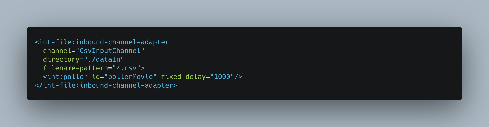
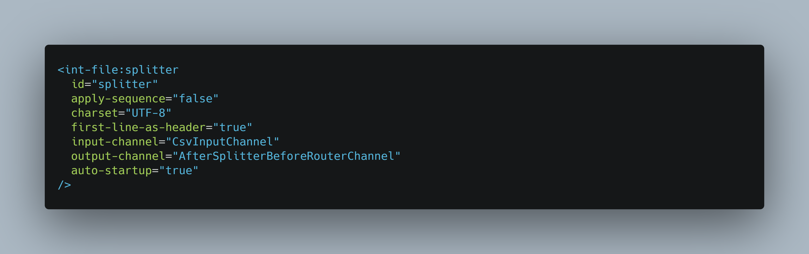
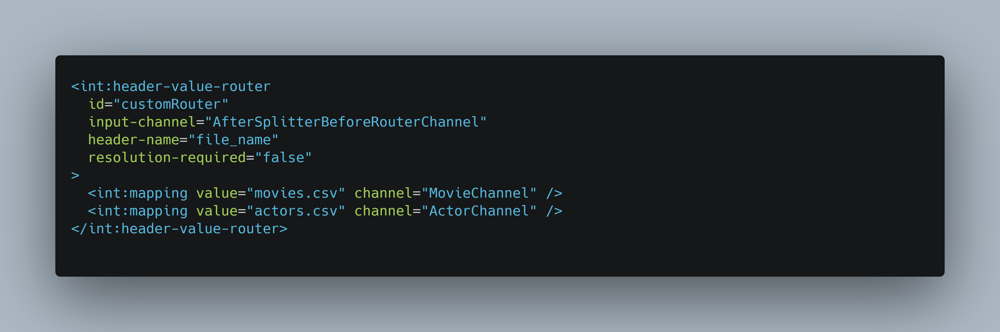
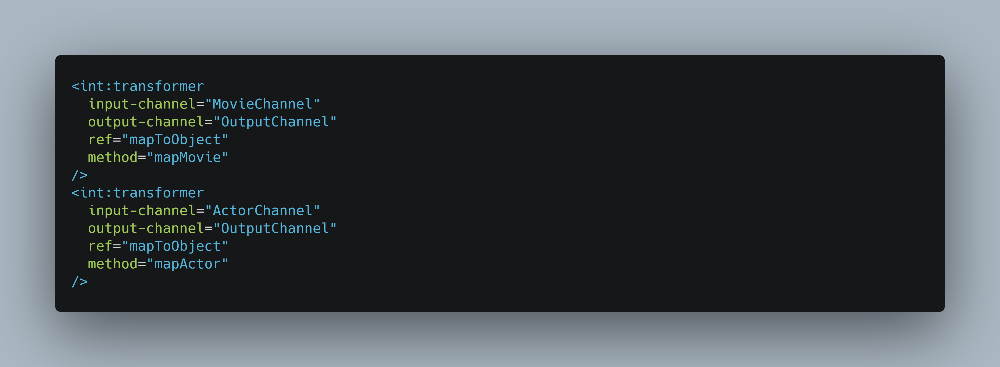
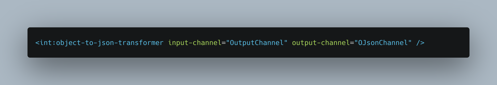
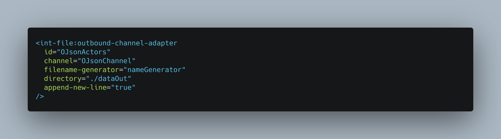
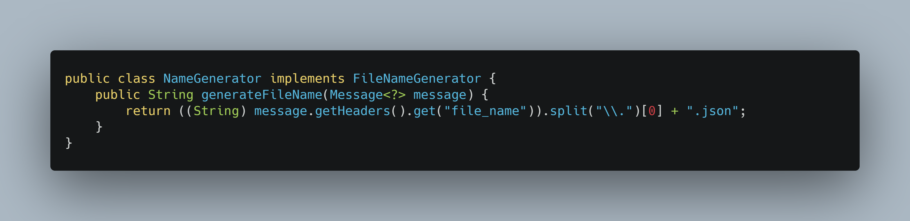
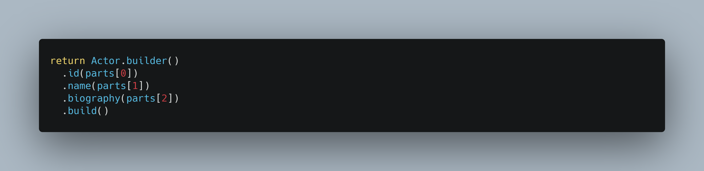

# EFREI-M2-ST2CCO-Spring-Integration
ST2CCO - Advanced Cloud Computing - Spring Integration

## Application Diagram

## Installation

You can import the project using IntelliJ IDEA software (`File` -> `Open` and select the project folder).

## Run

Using IntelliJ IDEA, you can run the project using the `Run` menu (or press `Alt`+`Maj`+`F10`)

## Spring patterns used in this project
- [`inbound-channel-adapter`](https://docs.spring.io/spring-integration/reference/html/channel-adapter.html#channel-adapter-namespace-inbound) - used to read files for a specific directory (here `dataIn`)

- [`splitter`](https://docs.spring.io/spring-integration/reference/html/splitter.html#configuring-a-splitter-with-xml) - used to parse the message string into csv object

- [`header-value-router`](https://docs.spring.io/spring-integration/reference/html/message-routing.html#router-implementations-headervaluerouter) - used to route message based on his source file name (eg. [`actors.csv`](./dataIn/actors.csv) or [`movies.csv`](./dataIn/movies.csv))

- [`transformer`](https://docs.spring.io/spring-integration/reference/html/transformer.html) - used to convert the message payload (a csv object) into a JAVA (`Actor` or `Movie`) object

- [`object-to-json-transformer`](https://docs.spring.io/spring-integration/reference/html/transformer.html#json-transformers) - used to parse the JAVA (`Actor` or `Movie`) object into a JSON string

- [`outbound-channel-adapter`](https://docs.spring.io/spring-integration/reference/html/channel-adapter.html#channel-adapter-namespace-outbound) used to store the message payload into a file

- [`filename-generator`](https://docs.spring.io/spring-integration/reference/html/file.html#file-writing-file-names) - helper for `outbound-channel-adapter` pattern to determine the output filename based on the message header source filename

## Explainations

This Spring application will load the Schema-based configuration: [`movieApplication.xml`](./src/main/resources/moviesApplication.xml).
This file will define the overall "pipeline" to use for the application messages flow.

### Actors flow

We have first develop a flow for the `actors.csv` file, that include a custom [transformer](./src/main/java/test/MapToObject.java) (used to create an Actor object).

### Movies flow

After developing the actors flow, we have copied it for the movie input files. And we have made some ajustment :
- We have created a [specific transformer](./src/main/java/test/MapToObject.java) method to create a Movie Java Object

### Final Application flow

We have previously see that we use 2 flows that can be run side-by-side. Whit that in mind we can implement a router for each flow. As we know, Actors and Movies flow are almost identical :
- The `inbound-channel-adapter` must be adapted to parse both `actors.csv` and `movies.csv`, we have done that by using a wildcard on the source file name parameter: `*.csv`
- A specific transformer must be used for each message type: if the message is from the `actors.csv` we must use the `Actors Transformer` or if the message if from the `movies.csv` file we must use the `Movies Transformer`. After searching the Spring documentation, we have fount that a router is able to do this job. As we know the source filename is save in each message header, we have implemented a `header-value-router` to route each message to the corresponding Transformer.

## Tips & project notes

In order to parse the file `*.csv` into a Java CSV object we have used the [`opencsv`](http://opencsv.sourceforge.net/) helper.

In order to minimize the application code, we have used the [`lombok`](https://projectlombok.org/features/all).